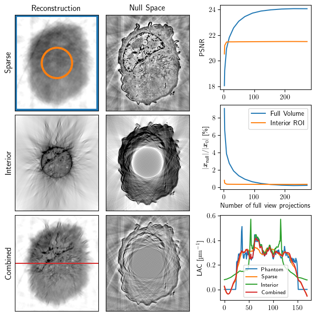

# Interior soft x-ray tomography with sparse global sampling

This repository contains the code and data used to reproduce the numerical results in the article:

> **Interior soft x-ray tomography with sparse global sampling** <br> > _Axel Ekman, Jian-Hua Chen, Mark A. Le Gros, Carolyn Larabell, Venera Weinhardt_ <br>
> bioRxiv 2025.08.11.669333; doi: https://doi.org/10.1101/2025.08.11.669333

---



This work shows how a sparse set of full-field projections stabilizes the otherwise ill-posed interior tomography problem. In interior tomography, the reconstruction quality within the region of interest (ROI) is often limited by missing global information, resulting in ambiguous quantitative values in the reconstructed sample. By integrating a high-resolution interior scan with a few low-resolution full-field projections, we reduce the null space and enhance stability without dense global sampling. Unlike sinogram extension methods, which substitute low-resolution 'scout' data with high-resolution interior scans, we employ a combined reconstruction strategy that leverages all acquired data for the inversion.

## Necessary setup

We use jrc_macrophage-2 [[1]](#1) as a phantom sample for the simulated results. For the scripts to work, you need to setup a working directory in the config/conf.py.

```python
JANELIA_FOLDER = Path("your/path/here")
WD_FOLDER = Path("your/path/here")
```

where the phantom volume will be downloaded to `JANELIA_FOLDER` and the corresponding projection and reconstruction data will be stored in the working directory `WD_FOLDER`.

To install the required projection operators for the linearized model PSF model [[2]](#2) follow instructions in https://github.com/axarekma/ncxt_psftomo.

#### References

[1] Larissa Heinrich, Davis Bennett, David
Ackerman, Woohyun Park, John Bo-
govic, Nils Eckstein, Alyson Petruncio,
Jody Clements, Song Pang, C Shan Xu,
et al. Whole-cell organelle segmentation
in volume electron microscopy. Nature,
599(7883):141–146, 2021.

[2] Axel Ekman, Venera Weinhardt, Jian-
Hua Chen, Gerry McDermott, Mark A
Le Gros, and Carolyn Larabell. Psf cor-
rection in soft x-ray tomography. Journal
of structural biology, 204(1):9–18, 2018.
